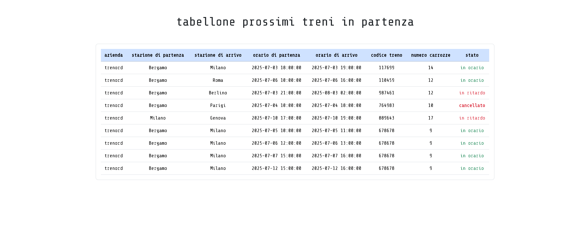

# Tabellone Treni

## giorno 1

### Obiettivo: Imparare a modellare la struttura dei database grazie alle Migrations.

### Milestone 1

Creare una tabella `trains` e relativa Migration, cercando di capire la natura dei campi necessari.

Ogni treno dovrà avere:

-   Azienda
-   Stazione di partenza
-   Stazione di arrivo
-   Orario di partenza
-   Orario di arrivo
-   Codice Treno
-   Totale Carrozze
-   Se in orario o meno
-   Se cancellato o meno

### Milestone 2

Inventare dei dati fittizi e inserirli tramite MySQL.

Creare un `Model` per i treni ed un relativo `Controller` per poi mostrare nella `home page` tutti i treni che sono in partenza dalla data odierna in avanti, in ordine cronologico.

### Bonus

Inventare lo stile del tabellone treni.

risultato finale:

## giorno 2

### Obiettivo: inserire dei dati nel database tramite i seed.

### Milestone 2: inserire i dati utilizzando dei faker

